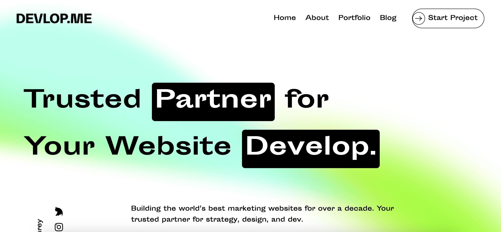

# 🚀 Develop.me — Animated Landing Page

A modern, fully responsive **landing page** built with **React**, **Tailwind CSS**, and **GSAP**. This project demonstrates clean component structuring, scroll-based animations, and mobile-friendly UI using modern web development tools.

> 🔗 **Live Site**: [https://developer-me-raintor.netlify.app](https://developer-me-raintor.netlify.app)

---

## 🌟 Features

- ⚛️ Built with **React** (functional components & hooks)
- 🎨 Styled using **Tailwind CSS**
- 🎞️ Smooth animations with **GSAP**
- 🎯 **Responsive Design** for all screen sizes
- 🎨 Icons from **React Icons**
- 💡 Clean code and semantic HTML
- 🚀 Deployed on **Netlify**

---

## 📁 Sections Included

1. ✅ **Navbar** – Responsive navigation with open/close animation
2. 💬 **Banner** – Eye-catching hero section with animated text
3. 👤 **About** – Personal introduction section
4. 🛠️ **Skills** – Showcasing technologies with animations
5. ⚙️ **Work Process** – Step-by-step animated flow
6. 📞 **Contact** – Call-to-action and inquiry form
7. 📎 **Footer** – Social icons and copyright

---

## 📸 Preview

 <!-- Optional: Replace with actual image URL or remove -->

---

## 🛠️ Built With

- [React](https://reactjs.org/)
- [Tailwind CSS](https://tailwindcss.com/)
- [GSAP (GreenSock Animation Platform)](https://gsap.com/)
- [React Icons](https://react-icons.github.io/react-icons/)
- [Netlify](https://www.netlify.com/) – for deployment

---

## 📦 Getting Started

### Clone the repository

```bash
git clone https://github.com/pronoyNath/raintor-task.git
cd develop.me
npm install
npm run dev
